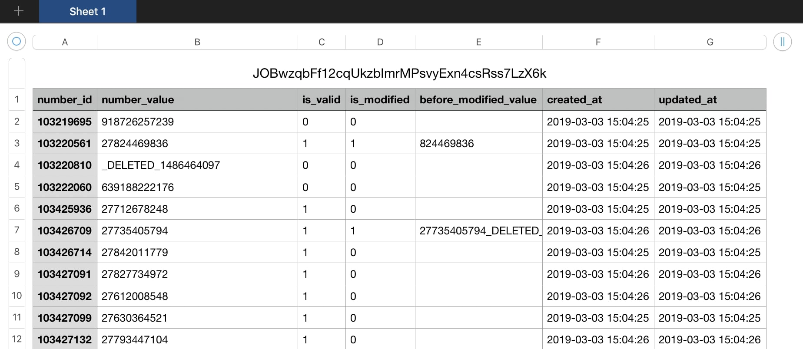

# Mobile Numbers Validation

A REST API application validates South African mobile numbers from a CSV file. It allows you to make POST requests to validate numbers and attempt to fix them.

**Technologies used;**
- Laravel 5.7.27 as framework
- Composer for dependency management
- MySQL 8.0.15 for database management
- Laravel Excel 3.1 for processing CSV files
- Laravel Passport for authentication



## Installation
* Clone the repository and go to project directory.

`git clone https://github.com/ebru/mobile-numbers-validation.git`

`cd mobile-numbers-validation`

* Create the .env file as a copy from the example file provided.

`cp .env.example .env`

* Connect to MySQL and create a database. You can find the sample terminal command below.

`mysql -u root -p`

mysql> ``create database `mobile-numbers-validation`; ``


* Update the .env file with database connection details.

```
DB_DATABASE=mobile-numbers-validation
DB_USERNAME={username}
DB_PASSWORD={password}
```

* After setting the environment, run the build script.

`./build.sh`

or the equivalent commands below.

```
composer install
php artisan key:generate
php artisan migrate
php artisan passport:install
php artisan storage:link
php artisan serve
```

...and you're all done! You have started the server on http://localhost:8000

## Sending Requests
You can send POST requests using tools like **Postman.** 
With the link below, you can directly import a test environment with endpoints provided.

`https://www.getpostman.com/collections/544b84d18057569e1d0e`

**Sample CSV File:**
You can find a sample file contains some South African mobile numbers inside project.

`/public/assets/sample_mobile_numbers.csv`

**Base URL:**
http://localhost:8000/api

## **1. create api token**
Returns an api token to send authenticated requests while registering the user.

**Reguest**

| Method  | URL            |
| --------|----------------|
| POST    | /register      |

| Type    | Params                 | Values        |
| --------|------------------------|---------------|
| POST    | name                   | String        |
| POST    | email                  | String        |
| POST    | password               | String        |

**Response**

```
{
    "token": "<api_token>"
}
```

## **2. validate numbers from a file**
Returns the validation details of numbers from file uploaded.

**Reguest**

| Method  | URL            |
| --------|----------------|
| POST    | /files         |

| Header         | Value                  |
| ---------------|------------------------|
| Accept         | application/json       |
| Authorization  | Bearer <api_token>     |

| Type    | Params                 | Values        |
| --------|------------------------|---------------|
| POST    | numbers_file           | File          |

* **numbers_file** is required.

**Response**

```
{
    "file": {
        "id": 11,
        "hash_name": "pJ3JdZFpYVA8CnMd8wMI2Ox2jXeUvJellABMurxv",
        "original_path": "/storage/files/original/pJ3JdZFpYVA8CnMd8wMI2Ox2jXeUvJellABMurxv.csv",
        "modified_path": "/storage/files/modified/pJ3JdZFpYVA8CnMd8wMI2Ox2jXeUvJellABMurxv.csv",
        "details": {
            "count": {
                "total_numbers": 1000,
                "valid_numbers": 531,
                "corrected_numbers": 74,
                "not_valid_numbers": 469
            }
        }
    }
}
```

## **3. get details of processed file by id**
Returns the validation details of a processed file with id given.

**Reguest**

| Method  | URL                |
| --------|--------------------|
| GET     | /files/{file_id}   |

| Header         | Value                  |
| ---------------|------------------------|
| Accept         | application/json       |
| Authorization  | Bearer <api_token>     |

* **file_id:** ID of the file you want the details of.

**Response**

```
{
    "file": {
        "id": 11,
        "hash_name": "pJ3JdZFpYVA8CnMd8wMI2Ox2jXeUvJellABMurxv",
        "original_path": "/storage/files/original/pJ3JdZFpYVA8CnMd8wMI2Ox2jXeUvJellABMurxv.csv",
        "modified_path": "/storage/files/modified/pJ3JdZFpYVA8CnMd8wMI2Ox2jXeUvJellABMurxv.csv",
        "details": {
            "count": {
                "total_numbers": 1000,
                "valid_numbers": 531,
                "corrected_numbers": 74,
                "not_valid_numbers": 469
            }
        }
    }
}
```

## **4. validate a single number**
Returns the validation details of a single number.

**Reguest**

| Method  | URL            |
| --------|----------------|
| POST    | /numbers         |

| Header         | Value                  |
| ---------------|------------------------|
| Accept         | application/json       |
| Authorization  | Bearer <api_token>     |

| Type    | Params                 | Values        |
| --------|------------------------|---------------|
| POST    | mobile_number          | String        |

* **mobile_number** is required.

**Responses**

```
// valid & not modified value
{
    "number": {
        "value": "27831234567",
        "details": {
            "is_valid": true,
            "is_modified": false,
            "before_modified_value": null
        }
    }
}

// valid & modified value with country code added
{
    "number": {
        "value": "27831234567",
        "details": {
            "is_valid": true,
            "is_modified": true,
            "before_modified_value": "831234567"
        }
    }
}

// valid & modified value parsed eliminating deleted part
{
    "number": {
        "value": "27831234567",
        "details": {
            "is_valid": true,
            "is_modified": true,
            "before_modified_value": "27831234567_DELETED"
        }
    }
}

// not valid value
{
    "number": {
        "value": "9983123456",
        "details": {
            "is_valid": false,
            "is_modified": false,
            "before_modified_value": null
        }
    }
}
```
